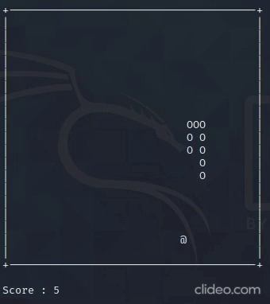

# Snake

Snake Game implementation written in C++ using ncurses library.

## Dependencies
This game is tested and written on Linux OS and probably will not work on Windows or any other OS.

Aside from that, you need **ncurses library** which is already install on Linux. I do not know why I even said that.

## Installation
To install the game, copy and paste below commands to your terminal:

Clone the repository to your current directory using this command: `git clone https://github.com/dogukanteber/Snake.git`

Run make and start the game: `make && ./snake`

## Playing
Snake is controled using <kbd>W</kbd>,<kbd>A</kbd>,<kbd>S</kbd>, and <kbd>D</kbd> keys. If you do not release these keys, the snake will move faster. <kbd>Q</kbd> will end the game. Other than that, there is nothing special about it. Enjoy.
